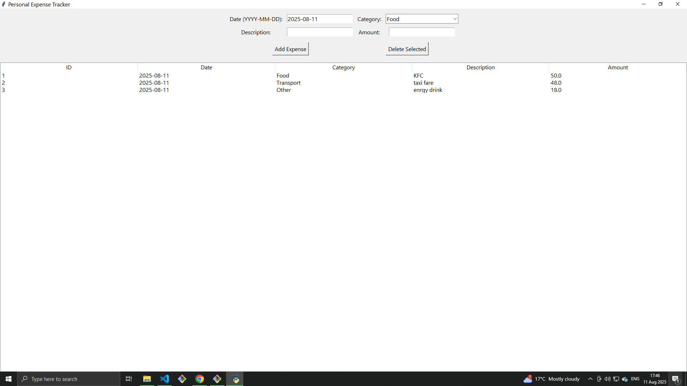

## Personal Expense Tracker
A clean, user-friendly desktop application built with Python, ttkbootstrap, and SQLite for tracking personal expenses. Features interactive charts for spending insights and CSV export functionality.

## Features
- Add, edit, and delete expenses with date, category, description, and amount fields

- Filter expenses by month and year for focused tracking

- Visualize spending trends with bar and pie charts

- Export filtered expense data to CSV files

- Responsive and modern UI using ttkbootstrap themes

## Tech Stack
- Python 3.x

- ttkbootstrap (modern ttk-based UI toolkit)

- SQLite (lightweight local database)

- matplotlib (for charts)

- tkinter (GUI framework, bundled with Python)

## Setup & Installation

Clone the repository:

```
git clone https://github.com/LeonNgwala/Expense-Tracker.git
cd personal-expense-tracker
```


```
python -m venv venv
source venv/bin/activate 
```

Install dependencies:

```
pip install -r requirements.txt
```

If requirements.txt is missing, install manually:

```
pip install ttkbootstrap matplotlib
```

Run the application:

```
python expense_tracker.py
```

## Usage
- Enter your expenses via the form at the top (Date, Category, Description, Amount).

- Use the filter dropdowns to view expenses for specific months or years.

- Double-click any expense row to edit it.

- Select an expense and click “Delete Selected” to remove it.

- Export filtered data to CSV using the “Export CSV” button.

- View spending summaries in the charts below.

## Project Structure
- expense_tracker.py — main application source code

- expenses.db — SQLite database file (created on first run)

- README.md — project documentation

## Contribution
Contributions are welcome! Feel free to fork the repo, submit pull requests, or report issues.


##  Screenshot

