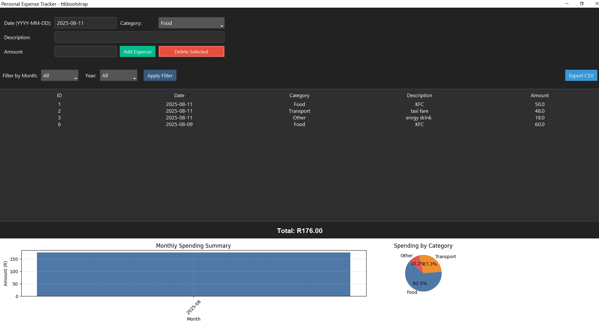

#  Tkinter Expense Tracker

A simple desktop application built with **Python Tkinter** and **SQLite3** for tracking personal expenses.  
You can add, view, and delete expenses with a clean GUI interface.

---

##  Features
- Add expenses with **Date, Category, Description, and Amount**
- View all expenses in a sortable **table**
- Delete selected expenses
- Data is saved locally using **SQLite3** (no internet needed)

---

##  Tech Stack
- **Python** (Tkinter for GUI)
- **SQLite3** (local database)
- **ttk.Treeview** for the expense table

---

##  How to Run
1. **Clone this repository**
   ```bash
   git clone https://github.com/LeonNgwalaE/Expense-Tracker.git
   cd tkinter-expense-tracker

----

## Screenshot
